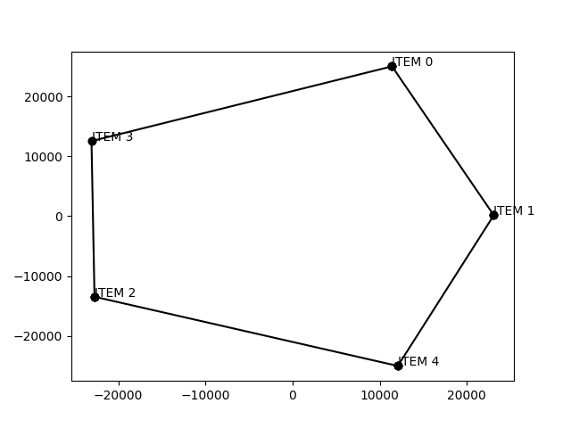
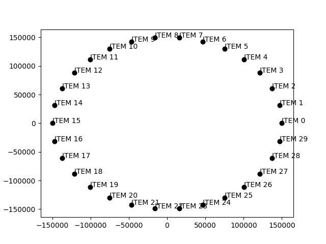
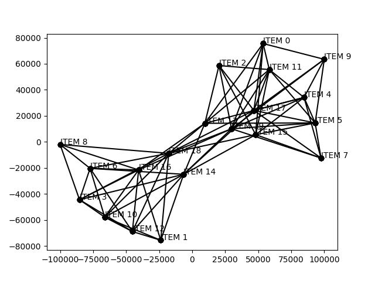
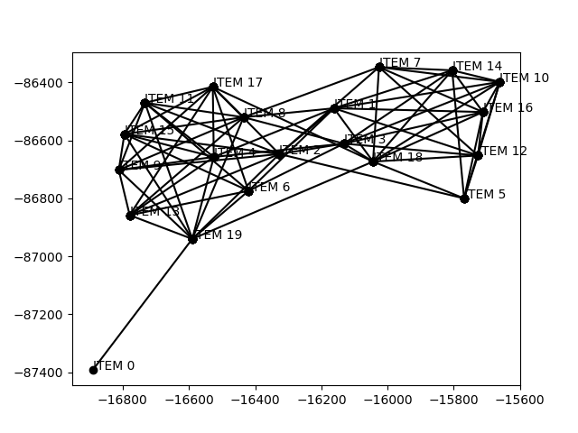
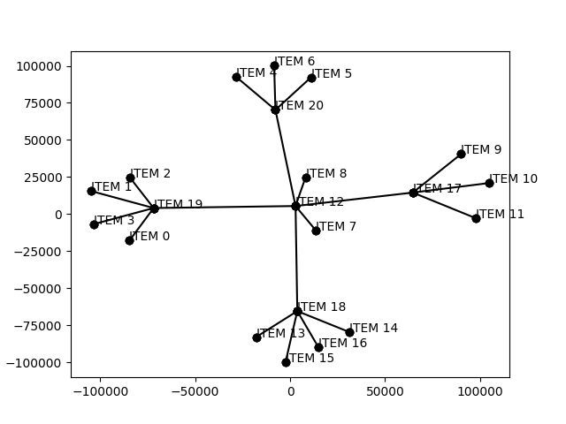

## Reference

-   https://dcc.fceia.unr.edu.ar/sites/default/files/uploads/materias/fruchterman.pdf


## To build on linux:

Run in GraphViz folder:
```
mkdir build
cd build
cmake ..
make
./main < input.txt
```

### Input Format

The first line should contain one integer $n$, where $n$ should less than 1000.

In $n$ next lines, each line should contain $n$ integers, where each integer can be 1 or 0, thus forming a *symmetric* matrix of size nxn.

```
5
1 1 0 1 0
1 1 1 0 1
0 1 1 1 1
1 0 1 0 0
0 1 1 0 1
```
## Some examples 


**Cicle (input1.txt):**




**Identity matrix of size 30x30 (input2.txt):**




**Random matrix 20x20 (input3.txt):**




**Random matrix 25x25 (input4.txt):**



**Tree (input5.txt):**




